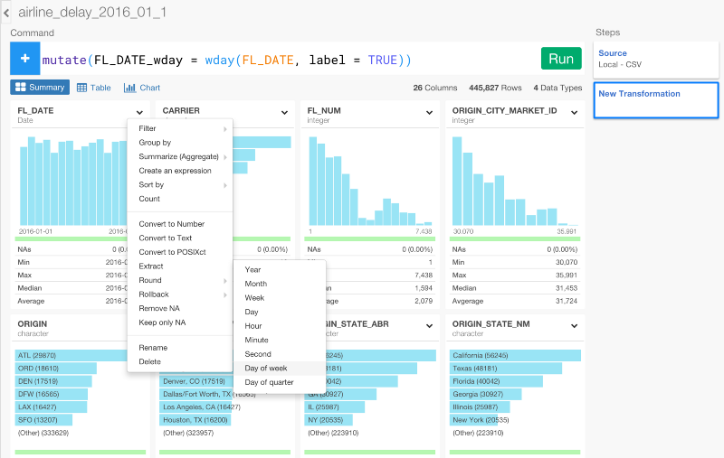
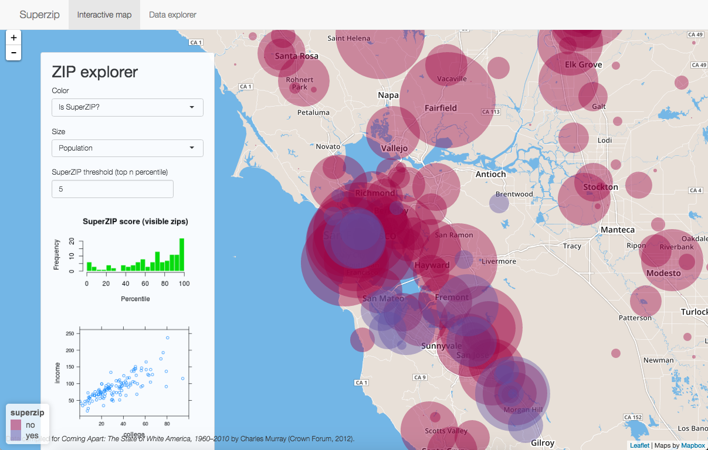
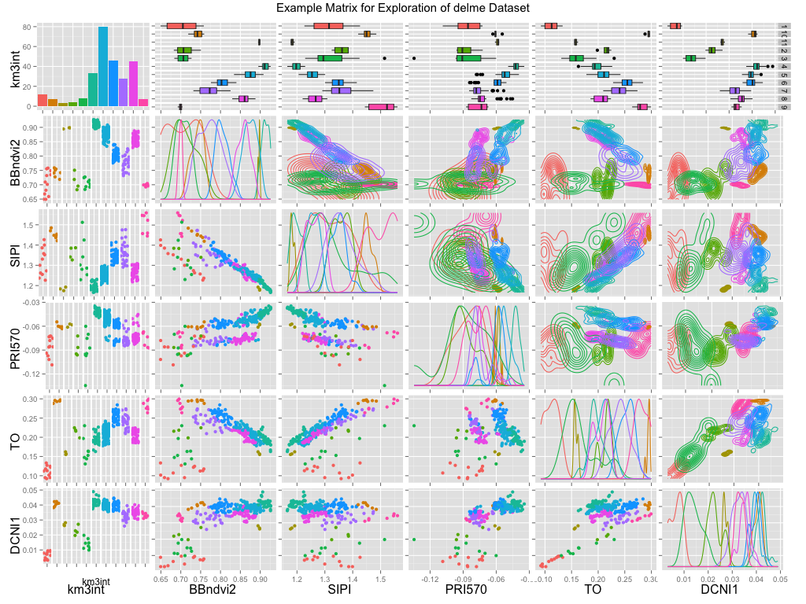

```{r setup, include=FALSE}
library(knitr)
library(nycflights13)
library(ggplot2)
library(dplyr)
library(dygraphs)
library(networkD3)
knitr::opts_chunk$set(echo = TRUE)
```

## Outline of this talk

- What is R?
- Why would I use it?
- Introduction to visualization systems in R
- Hands-on large data visualization example
- Q&A

# What is R?

## R Language Origins

- A programming environment for statistical computing
- An ecosystem of packages and systems
- Born in 1993, first release in 1997
- Based on S (1974), an interface for Fortran statistical methods
- Open source with academic roots

## R Dominates Data Science


## R vs. Python on Github


## R Language REPL

<aside class="notes">
Because S was originally conceived as an interface language, R is interactive by nature. It has a first-class REPL, or Read Evaluate Print Loop.
</aside>

    > head(women, 3)
      height weight
    1     58    115
    2     59    117
    3     60    120
     
    > summary(women)
         height         weight     
    Min.   :58.0   Min.   :115.0  
    1st Qu.:61.5   1st Qu.:124.5  
    Median :65.0   Median :135.0  
    Mean   :65.0   Mean   :136.7  
    3rd Qu.:68.5   3rd Qu.:148.0  
    Max.   :72.0   Max.   :164.0  
     
## Writing in R

- At the REPL (interactive) for EDA
- Compose scripts for repeatable analysis
- Create installable packages to share with others
- Mix with text for literate programming 
- Notebooks (RStudio, Jupyter)
    
# Why R? 

## Reproducibility

- Share your data analysis *process*, not just the final product
- Your analysis can be repeated, start to finish
    - Validation of results by others
    - Re-run analysis when data changes
- R scripts are just text
    - Amenable to version control
    - Easy to share, combine, edit, remix

## Ecosystem (data pipeline)

<aside class="notes">
Again, R's strengths are not just as a language but as a platform. Data visualization can be thought of as the final step of analysis; to get to the visualization step, you first need to import your data.

Then you need to shape it into the right format and analyze/summarize. Finally, you can visualize the data. R gives you the tools you need to do all of this in one system. It becomes a sort of glue you can use to bring your whole analysis and visualization process together
</aside>

- Data import (readxl, rodbc, rvest)
- Data tidying, transformation (dplyr, tidyr)
- Analysis, modeling, simulation (various)
    - Many new stats tools are in R first
- Visualization systems (ggplot, htmlwidgets)
- Reporting systems (knitr, rmarkdown)

## Ecosystem growth

<aside class="notes">
Tools provided by a single company often grow in a linear way, but R is powered by a community and the growth of its capaiblities has been closer to exponential.
</aside>


# R Data Visualization

<aside class="notes">
Now that we've looked at R as a platform, let's take a closer look at its visualization capabilities. 
</aside>

## Output formats

<aside class="notes">
R has two main visualization systems that we'll talk about today. The one used most frequently is its graphics devices. An R graphics device takes a set of drawing commands (lines, circles, points, etc) and produces output -- an image for a Web site, a vector graphic for a PDF, etc. Because R's plotting libraries emit drawing commands, not pixels, your R visualizations can be recreated and exported with perfect fidelity to a large variety of output devices. 

The second one is a newer extension which allows bindings to existing JavaScript libraries. These allow you to take R objects and visualize them natively with the exploding set of JavaScript visualization libraries.
</aside>

- Graphics Devices
    - Built-in primitives
    - Drawing commands issued by plotting libraries
    - Publication quality PDF, SVG, PNG, JPG, etc. 
- HTML
    - Tags emitted by plotting libraries
    - Modern, interactive web visualizations 
    - Use third-party JavaScript plotting libraries
  
## Simple visualizations

<aside class="notes">
Any data can be visualized in R with almost no work at all. It won't be beautiful, but sometimes you just want to see data with a minimum of fuss. 
</aside>

```{r}
head(faithful, 3)
```

```{r, eval = FALSE}
plot(faithful)
```

## Base graphics

```{r, echo = FALSE}
plot(faithful)
```

## The grammar of graphics

<aside class="notes">
When you express your visualizations in R, they're declarative and reproducible because they're expressed in code. 

Most R graphics libraries use what's called the "grammar of graphics". This includes the graphics library "ggplot2", which is the most popular R graphics library. Let's take a look at an example. In this case I have a set of cars, and I want to understand the relationship between MPG, horsepower, and cylinders.

Here I express the plot's main properties and then begin to compose a declarative statement about the plot using layers.

This may look foreign to you, but it quickly becomes easy to read. Compare this simple, compact representation to what you'd get out of a point and click tool. Everything about it is easy to tweak and modify. And if you want a colleague to be able to modify it, you need only copy and paste some text, not share a large file in a proprietary format.
</aside>

```{r, eval=FALSE}
ggplot(mtcars, aes(x = mpg, y = hp)) +
  geom_point(color = mtcars$am + 1) + 
  geom_smooth(method = "lm") + 
  facet_wrap(~ cyl)
```

## The grammar of graphics

```{r, echo=FALSE}
ggplot(mtcars, aes(x = mpg, y = hp)) +
  geom_point(color = mtcars$am + 1) + 
  geom_smooth(method = "lm") + 
  facet_wrap(~ cyl)
```

## Interactive graphics

<aside class="notes">
One of the best things about the R platform is that it can be easily "glued" to other systems. That means that data visualizations in R are not limited to what R itself can produce. 

We just saw an example of R's base graphics, which was not very pretty, and an example from a third-party graphics library called ggplot2, which was much better-looking. 

Much of the interesting data visualization being done these days is happening on the web. Web visualizations are popular because they are easy to create and share -- you don't need special software to view them. R does not itself know how to write web data visualizations, but that doesn't matter because it comes with packages that do. 

Here's a quick interactive web visualization of male and female deaths due to lung disease. First, I join the data sets together, then pass the data to dygraphs. This is a function from a package that knows how to pass R data to the dygraphs JavaScript graphing library. We'll graph the variables and then add a range selector so we can interact with them.
</aside>

```{r, eval=FALSE}
lungDeaths <- cbind(mdeaths, fdeaths)

dygraph(lungDeaths) %>% 
   dyRangeSelector()
```

## Interactive graphics

```{r, echo=FALSE}
lungDeaths <- cbind(mdeaths, fdeaths)

dygraph(lungDeaths) %>% 
   dyRangeSelector()
```

## Interactive graphics

<aside class="notes">
Here's another interactive graphic made with just a few lines of R. It's a force-directed graph of the relationships between characters in Les Miserables. You can quickly identify some of the central groups of characters in this graph.
</aside>

```{r, eval=FALSE}
data(MisLinks, MisNodes)
forceNetwork(Links = MisLinks, Nodes = MisNodes, Source = "source",
             Target = "target", Value = "value", NodeID = "name",
             Group = "group", opacity = 0.4)
```

## Interactive graphics

```{r, echo=FALSE}
data(MisLinks, MisNodes)
forceNetwork(Links = MisLinks, Nodes = MisNodes, Source = "source",
             Target = "target", Value = "value", NodeID = "name",
             Group = "group", opacity = 0.4)
```

# Data Visualization Challenge

## The Flights Data

<aside class="notes">
Now let's solve a specific data visualization problem so you can get a flavor for what working in R is like. 

When you're visualizing lots of data, one of the key challenges is that the sheer quantity of data can make it difficult to view all at once. For instance, suppose that we're interested in the relationship between how long a flight is and how late it is likely to be. To tackle this problem we're going to use a data set with about a third of a million observations.
</aside>

```{r}
nrow(flights)
colnames(flights)
```

## A Naive Approach

<aside class="notes">
You could easily imagine that this relationship could go either way -- naively there are more things that could go wrong to cause a delay on a longer flight, but of course airline companies know this, and perhaps they err on the side of saftey for longer flights, making them more actually *more* likely to arrive on time. 

Here's a straightforward visualization of these flights; there are about a third of a million of them. This is what might happen if you try to visualize this relationship with a traditional drag and drop tool.
</aside>

```{r, eval=FALSE}
ggplot(flights, aes(x = distance, y = arr_delay)) + 
  geom_point()
```

## Subsetting

<aside class="notes">
There's just too much data in that last approach for us to see what's going on, so let's try using *less* data. Because this data might be sorted in some way, we need to take a random sample of, let's say, 300 flights (or only 0.1% of the data). Before we do this, imagine briefly how you'd do this in any other tool.
</aside>

```{r, eval=FALSE}
randomflights <- flights %>% 
  sample_n(300)

ggplot(randomflights, aes(x = distance, y = arr_delay)) + 
  geom_point()
```

## Subsetting

```{r, echo=FALSE, warning=FALSE}
randomflights <- flights %>% 
  sample_n(300)

ggplot(randomflights, aes(x = distance, y = arr_delay)) + 
  geom_point()
```

## Subsetting

<aside class="notes">
Now we can see the data a little better, but we should be worried about the fact that we're using only 0.1% of the data! What if that isn't a representative sample? Let's pick 9 samples instead and plot them all to see if a pattern emerges.

Because this is code, it's easy to run it over and over again to see a different set of samples if we want to. 
</aside>

```{r, eval=FALSE}
randomsample <- flights %>%   
  sample_n(2700) %>% 
  bind_cols(data.frame(sample = rep(1:9, 300)))

ggplot(randomsample, aes(x = distance, y = arr_delay)) + 
  geom_point() +
  facet_wrap( ~ sample)
```

## Subsetting

```{r, echo=FALSE, warning=FALSE}
randomsample <- flights %>%   
  sample_n(2700) %>% 
  bind_cols(data.frame(sample = rep(1:9, 300)))

ggplot(randomsample, aes(x = distance, y = arr_delay)) + 
  geom_point() +
  facet_wrap( ~ sample)
```

## Processing

<aside class="notes">
We're still having a hard time seeing a pattern here, so it's time to start processing the data to make it easier to visualize. Again I'll stress that this is one of the very best reasons to use R as a data visualization tool -- because it's not *just* a data visualization tool; it gives you an incredibly powerful toolkit to shape the data as well as visualize it.

Let's start by getting rid of the very longest flights. You might call these outliers; they're causing all the data to clump together at one end of the graph. Of course, if we really wanted to include these flights we could also use a different scale, or analyze them separately.
</aside>

```{r, eval=FALSE}
randomflights <- flights %>% 
  filter(distance < 2000) %>% 
  sample_n(300)

ggplot(randomflights, aes(x = distance, y = arr_delay)) + 
  geom_point()
```

## Processing

```{r, echo=FALSE, warning=FALSE}
randomflights <- flights %>% 
  filter(distance < 2000) %>% 
  sample_n(300)

ggplot(randomflights, aes(x = distance, y = arr_delay)) + 
  geom_point()
```

## Processing

<aside class="notes">
How can we make this better? One thing we can take advantage of is that there are multiple instances of each flight. Perhaps instead of plotting each individual flight on the chart, we can plot a point that summarizes each flight's delays. 

Here's how we do that: we group by the tail number. Then we create a summary that includes the number of flights, the average distance, and the average delay for that flight. Finally, we exclude flights that have fewer than 20 samples or are very long -- as we've previously established these are going to be outliers.
</aside>

```{r, eval=FALSE}
delay <- flights %>% 
  group_by(tailnum) %>%
  summarise(count = n(), dist = mean(distance), delay = mean(arr_delay)) %>%
  filter(count > 20, dist < 2000, delay < 50, !is.na(delay)) %>%
  collect

ggplot(delay, aes(x = dist, y = delay)) +
  geom_point()
```

## Processing

```{r, echo=FALSE, warning=FALSE}
delay <- flights %>% 
  group_by(tailnum) %>%
  summarise(count = n(), dist = mean(distance), delay = mean(arr_delay)) %>%
  filter(count > 20, dist < 2000, delay < 50, !is.na(delay)) %>%
  collect

ggplot(delay, aes(x = dist, y = delay)) +
  geom_point()
```

## Processing

<aside class="notes">
Now we're getting somewhere! Let's make those points a little easier to see. We'll map the point's size to the number of flights, and give it some transparency to make clusters obscure each other less.
</aside>

```{r, eval=FALSE}
ggplot(delay, aes(x = dist, y = delay)) +
  geom_point(aes(size = count), alpha = 1/3) + 
  scale_size_area(max_size = 3)
```

## Processing

```{r, echo=FALSE, warning=FALSE}
ggplot(delay, aes(x = dist, y = delay)) +
  geom_point(aes(size = count), alpha = 1/3) + 
  scale_size_area(max_size = 3)
```

## Modeling

<aside class="notes">
Up until now all we've done is plot existing data. Now, let's use R's statistical modeling features to help us see the trend here. We'll start by drawing the same graph, but with a linear model fitted to the data.
</aside>

```{r, eval=FALSE}
ggplot(delay, aes(x = dist, y = delay)) +
  geom_point(aes(size = count), alpha = 1/3) + 
  scale_size_area(max_size = 3) +
  geom_smooth(method = "lm")
```

## Processing

```{r, echo=FALSE, warning=FALSE}
ggplot(delay, aes(x = dist, y = delay)) +
  geom_point(aes(size = count), alpha = 1/3) + 
  scale_size_area(max_size = 3) +
  geom_smooth(method = "lm")
```

## Modelling

<aside class="notes">
The linear model helps us see that there is in fact a slightly negative trend -- that is, the longer a flight is, the shorter the delay is likely to be. But the effect is not very big, and it looks like it varies a lot depending on the length. Again, we have all of R's statistical tools here, so let's fit a different kind of model to this data.

This is the first visualization that really gives us some insight. The effect is somewhat weak, but we can see that longer flights tend to be more delayed up until about 1,000 miles. For flights between 1,000 and 1,500 miles, the trend is downwards, and then it starts rising again after 1,500 miles.
</aside>

```{r, eval=FALSE}
ggplot(delay, aes(x = dist, y = delay)) +
  geom_point(aes(size = count), alpha = 1/3) + 
  scale_size_area(max_size = 3) +
  geom_smooth(method = "loess")
```

## Modelling

```{r, echo=FALSE}
ggplot(delay, aes(x = dist, y = delay)) +
  geom_point(aes(size = count), alpha = 1/3) + 
  scale_size_area(max_size = 3) +
  geom_smooth(method = "loess")
```

## Modelling
<aside class="notes">
Of course, we can slice this any way we want. What if we wanted to go by time rather than distance? Easy to tweak. As you'd expect this produces a virtually identical graph because there's a linear relationship between time and distance.
</aside>

```{r, eval=FALSE}
delay <- flights %>% 
  group_by(tailnum) %>%
  summarise(count = n(), airtime = mean(air_time), delay = mean(arr_delay)) %>%
  filter(count > 20, airtime < 250, delay < 50, !is.na(delay)) %>%
  collect

ggplot(delay, aes(x = airtime, y = delay)) +
  geom_point(aes(size = count), alpha = 1/3) + 
  scale_size_area(max_size = 3) +
  geom_smooth(method = "loess")
```

## Modelling

```{r, echo=FALSE}
delay <- flights %>% 
  group_by(tailnum) %>%
  summarise(count = n(), airtime = mean(air_time), delay = mean(arr_delay)) %>%
  filter(count > 20, airtime < 250, delay < 50, !is.na(delay)) %>%
  collect

ggplot(delay, aes(x = airtime, y = delay)) +
  geom_point(aes(size = count), alpha = 1/3) + 
  scale_size_area(max_size = 3) +
  geom_smooth(method = "loess")
```

## But I don't want to code...

<aside class="notes">
R is by nature a code-centric environment, but sometimes during the exploratory phase of data analysis you want to point and click. R's open nature has allowed third-party tools for doing this to flourish. Here's an interactive tool for data exploration called Exploratory. 
</aside>



# Reporting

<aside class="notes">
So now we've produced a visualization we can share. Of course, that isn't the end of the story. This visualization probably needs to go somewhere -- into a report, onto a web dashboard, in an e-mail. 
</aside>

## Static reporting systems

    The relationship is made clear by the following graph:
```{r, echo=FALSE, results='asis'}
cat(paste("    ```{r}",
          "    plot(x = var1, y = var2, type = \"p\")",
          "    ```", sep = "\n"))
```

- Literate programming intersperses narrative and code
- sweave: for LaTeX, etc. 
- knitr: use Markdown input
- R Markdown: built on knitr + pandoc; text and code together compiled with output to documents, web sites, and presentations
- This entire presentation was built with R and R Markdown

## Applications & interactive reporting

- Shiny web framework
- Web applications that show R visualization results
- Applications can run R code to replay analysis 

## Shiny example



# More Visualization Examples

## Vaccination Efficacy


## Autism Prevalence


## Dataset Exploration



# Wrapup

## Bigger data challenges

<aside class="notes">
If you know a little more about R, you know that by nature it deals with data sets which are loaded into memory.  So how do you visualize even more data than can fit into RAM? 

The short answer is that it's not possible to draw more points than you have in RAM, but that's probably not what you wanted anyway; there aren't enough pixels on your screen to see a million data points. What you want to do is keep your data in its store, but use R to select the portion of the data you want to visualize. 
</aside>

- RAM limitations and backing stores
- More packages to get at your data
- dplyr and backends: front end to data 
- Interface with Spark, hadoop, etc.

## Acknowledgements

- Hadley Wickham 
- J.J. Allaire
- Joe Cheng

# Q & A

## Further reading

    jonathan@rstudio.com

Source for slides available here:

    https://github.com/jmcphers/datavis-talk

[Exploratory Data](https://exploratory.io/)
[HTML Widgets for R](http://www.htmlwidgets.org/index.html)
[Spark Interface for R](https://github.com/rstudio/sparklyr) 
[R for Data Science](http://r4ds.had.co.nz/) by Hadley Wickham and Garrett Grolemund
[ggplot2.SparkR](https://github.com/SKKU-SKT/ggplot2.SparkR)

